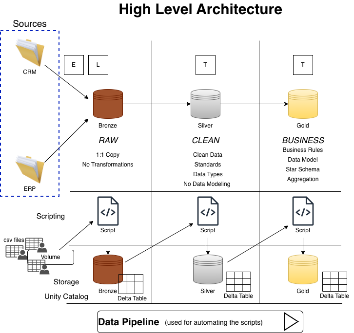

# Data Lakehouse — Version 1

## Data Architecture

The data architecture for this project follows the **Medallion Architecture** with **Bronze**, **Silver**, and **Gold** layers, built on top of **Databricks** and **Unity Catalog**:

1. **Bronze Layer**: Stores raw data as-is from source CSV files. Data is ingested directly into Delta tables in the Bronze schema without any transformations.
2. **Silver Layer**: Applies data cleansing, standardization, and normalization on top of Bronze tables. Each source table is processed individually to resolve quality issues and prepare data for modeling.
3. **Gold Layer**: Houses business-ready data modeled into a **star schema** — with fact and dimension tables — designed for reporting and analytics.

---

## Project Overview

This project involves:

1. **Data Architecture**: Designing a Modern Data Lakehouse using Medallion Architecture (Bronze, Silver, Gold) on Databricks with Unity Catalog.
2. **ETL Pipelines**: Extracting, transforming, and loading data from source CSV files through all three layers using PySpark and Spark SQL.
3. **Data Modeling**: Developing fact and dimension tables in the Gold layer optimized for analytical queries.
4. **Pipeline Orchestration**: Automating the end-to-end flow using Databricks Jobs with orchestration notebooks for each layer.
5. **Analytics & Reporting**: Enabling SQL-based reporting and dashboards on top of Gold tables.

---

## Project Requirements

### Building the Lakehouse

#### Objective
Develop a modern data lakehouse on Databricks to consolidate sales data across ERP and CRM systems, enabling scalable analytical reporting and informed decision-making.

#### Specifications
- **Data Sources**: Ingest data from two source systems (ERP and CRM), provided as 6 CSV files.
- **Storage**: Use Databricks Unity Catalog with three schemas — `bronze`, `silver`, and `gold`.
- **Data Quality**: Cleanse and resolve all data quality issues in the Silver layer prior to modeling.
- **Integration**: Combine all sources into a unified star schema model designed for analytical queries.
- **Scope**: Focus on the latest dataset only; historization of data is not required.
- **Documentation**: Provide clear documentation of notebooks, transformations, and the data model to support both business stakeholders and analytics teams.

---

## Build Phases

### Phase 1 — Environment Setup

- Connect GitHub to Databricks via Git Folder (`Workspace → Create → Git Folder`)
- Create Lakehouse schemas in Unity Catalog: `bronze`, `silver`, `gold`
- Create a volume inside the Bronze schema: `system_sources`
- Upload all 6 source CSV files into the Bronze volume

---

### Phase 2 — Bronze Layer

**Goal**: Ingest all raw CSV files into Delta tables without any transformations.

- For each of the 6 CSV files:
  - Read the CSV into a DataFrame
  - Write it to a Bronze table using **overwrite mode**
  - Use a source-system prefix in the table name (e.g., `erp_` or `crm_`) to identify the origin
  - Query the table to verify it loaded correctly
- Run the full Bronze notebook end-to-end

---

### Phase 3 — Silver Layer

**Goal**: Clean and transform Bronze data and load the results into the Silver layer.

For each of the 6 Bronze tables, a dedicated Silver notebook is created (`silver_<source>_<table_name>`):

**Data Quality Analysis**
- Find duplicates
- Validate string values: extra spaces, abbreviations to normalize
- Validate date values: check data type, format, and handle nulls
- Validate numeric values
- Standardize business key IDs for correct joins

**Notebook Structure**
- **Section 1**: Read from Bronze table into a DataFrame
- **Section 2**: Apply transformations step-by-step (one fix at a time, verified with `df.display()`)
- **Section 3**: Write the clean DataFrame to a Silver table with a friendly name

**Finalization**
- Run the full notebook end-to-end
- Added comments and documentation

---

### Phase 4 — Gold Layer

**Goal**: Break away from source-system structure and introduce a business-oriented star schema.

**Data Modeling**
- Map each table to a business object (customers, products, sales)
- Design the target data model using draw.io — example: `fact_sales`, `dim_customers`, `dim_products`

**Building Gold Tables**
For each Gold table:
- Join all relevant Silver tables
- Ensure no duplicates after joins
- Validate query output
- Write the result to a Gold Delta table using clear naming prefixes:
  - `dim_` for dimension tables
  - `fact_` for fact tables

---

### Phase 5 — Pipeline Orchestration

**Goal**: Automate the end-to-end Lakehouse flow from Bronze to Silver to Gold.

**Orchestration Notebooks**
- `silver_orchestration.py`: Triggers all 6 Silver notebooks in sequence using `dbutils.notebook.run`
- `gold_orchestration.py`: Triggers all Gold notebooks in sequence using `dbutils.notebook.run`

**Databricks Job Setup**
- Created a new Job (e.g., `loading_bike_data_lakehouse`) with three tasks:
  1. **Bronze Task**: Run the Bronze notebook
  2. **Silver Task**: Run the Silver orchestration notebook
  3. **Gold Task**: Run the Gold orchestration notebook
- Run the job and validate that all tasks complete successfully

**Scheduling**
- Add a daily trigger to the job
- Monitor runs and check logs 

---

### BI: Analytics & Reporting

#### Objective
Enable SQL-based analytics on Gold layer tables to deliver detailed insights into:

- **Customer Behavior**
- **Product Performance**
- **Sales Trends**

---

## Tech Stack

| Tool | Purpose |
|---|---|
| **Databricks** | Unified analytics platform |
| **Apache Spark / PySpark** | Data processing and transformations |
| **Delta Lake** | Storage format for all Lakehouse layers |
| **Unity Catalog** | Data governance and schema management |
| **Databricks Jobs** | Pipeline orchestration and scheduling |
| **GitHub** | Version control |
| **draw.io** | Data model design |

---

## License

This project is licensed under the [MIT License](LICENSE). You are free to use, modify, and share this project with proper attribution.
