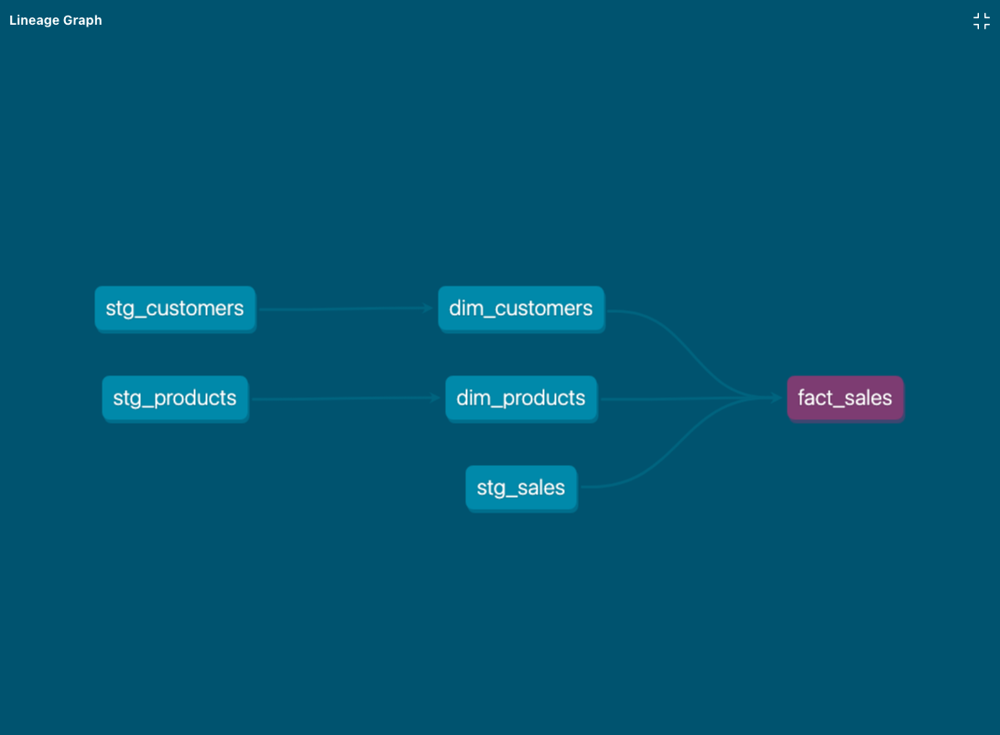
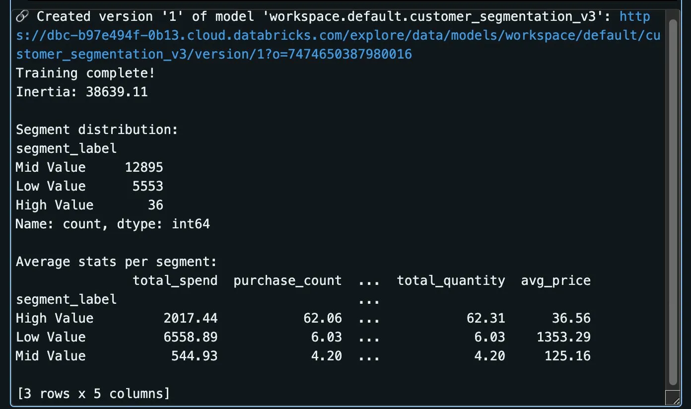

# Data Lakehouse — Version 3

## Overview
Version 3 builds on top of [Data Lakehouse V2](https://github.com/ap001AP/sql-data-lakehouse-project/tree/lakehouse_v2) by adding a **dbt transformation layer**, **automated data quality checks**, an expanded **CI/CD pipeline**, and a full **AI/ML layer** with trained models, experiment tracking, and live REST API endpoints.

---

## What's New in V3

- **dbt Core Integration**: Replaced Gold layer SQL notebooks with version-controlled dbt models — staging views and Gold dimension/fact tables are now defined as `.sql` files with full lineage tracking and auto-generated documentation.
- **Automated Data Quality Tests**: Built 17 dbt schema tests covering uniqueness, null checks, and referential integrity across all staging and Gold models.
- **Duplicate Customer Deduplication**: Discovered and resolved 5 duplicate customer IDs in the Silver layer using a `ROW_NUMBER()` window function to keep the most recent record per customer.
- **Null Sales Amount Fix**: Identified 8 rows with null `sales_amount` and imputed values using `price * quantity` directly in the staging model.
- **Great Expectations DQ**: Implemented automated Bronze layer validation checks on 18,494 customer records — catching 4 null customer IDs and 11 duplicate records before they reach Silver transformations.
- **CI/CD Expansion**: Extended GitHub Actions pipeline to three sequential stages — unit tests → dbt run + dbt test → Databricks deploy. All stages must pass before deployment.
- **Sales Forecasting Model**: Trained a Random Forest model on 89,794 sales records with MLflow experiment tracking — registered as `sales_forecasting_v3` Version 1 in the Unity Catalog Model Registry.
- **Customer Segmentation Model**: Trained a KMeans clustering model to segment 18,484 customers into 3 value tiers — registered as `customer_segmentation_v3` Version 1.
- **Model Serving REST Endpoint**: Deployed the sales forecasting model as a live Databricks REST API endpoint — tested end to end with real-time predictions.
- **Automated Daily Retraining**: Both ML models added to the production pipeline and retrain automatically every day when new Gold data arrives.
- **Databricks DQ Alerting**: Configured automated SQL alerts monitoring Bronze layer for null customer IDs, duplicate records, and null sales amounts with daily email notifications.

---

## Architecture
```
Source Systems
CSV Files · PostgreSQL (Render) · REST Countries API · Apache Kafka (Aiven)
        ↓
Bronze Layer — Raw ingestion into Delta tables
        ↓ Great Expectations DQ checks + Databricks Alerts
Silver Layer — PySpark transformations, data quality, standardization
        ↓
dbt Staging Views — stg_customers, stg_products, stg_sales
        ↓
Gold Layer — dim_customers, dim_products, fact_sales (built by dbt)
        ↓
ML Layer — Feature Engineering → MLflow → Model Registry → REST Endpoint
```

---

## dbt Data Lineage



---

## ML Model Results

### Sales Forecasting Model
| Metric | Value |
|---|---|
| **Model** | Random Forest Regressor |
| **Training rows** | 89,794 |
| **Features** | quantity, price, order_month, order_year, order_dayofweek |
| **MAE** | 0.01 |
| **R2 Score** | 1.0 |
| **Registered model** | `sales_forecasting_v3` Version 1 |
| **Serving endpoint** | `sales-forecast-endpoint` (live REST API) |

**Sample prediction:**
```
Input:  quantity=2, price=$1,500, month=6, year=2026, day_of_week=2
Output: predicted sales = $1,701.00
```

### Customer Segmentation Model



**Key insight:** The "Low Value" segment is misleading by name — these customers spend the most per customer ($6,559 avg) but buy infrequently with high-ticket items. A real business would rename these segments based on purchasing behavior to better inform marketing strategy.

| Metric | Value |
|---|---|
| **Model** | KMeans Clustering |
| **Customers segmented** | 18,484 |
| **Features** | total_spend, purchase_count, avg_order_value, total_quantity, avg_price |
| **Clusters** | 3 |
| **Inertia** | 38,639 |
| **Registered model** | `customer_segmentation_v3` Version 1 |

---

## dbt Tests — 17/17 Passing

| Model | Tests |
|---|---|
| `stg_customers` | unique + not_null on customer_id |
| `stg_products` | unique + not_null on product_id |
| `stg_sales` | not_null on order_number, sales_amount, quantity, price |
| `dim_customers` | unique + not_null on customer_key, not_null on customer_id, first_name, last_name |
| `dim_products` | unique + not_null on product_key |
| `fact_sales` | not_null on order_number, sales_amount |

---

## CI/CD Pipeline

Every push to `lakehouse_v3` branch triggers:
```
Push to GitHub
      ↓
Run pytest unit tests
      ↓ (only if all pass)
Run dbt models + 17 schema tests
      ↓ (only if all pass)
Deploy bundle to Databricks dev environment
```

---

## Tech Stack
| Tool | Purpose |
|---|---|
| **Databricks** | Unified analytics and pipeline platform |
| **Delta Lake** | Storage format for all Lakehouse layers |
| **Unity Catalog** | Data governance and schema management |
| **dbt Core** | SQL transformation models with testing and lineage |
| **Great Expectations** | Automated Bronze layer data quality validation |
| **MLflow** | ML experiment tracking and model registry |
| **Databricks Model Serving** | Live REST API endpoint for real-time predictions |
| **scikit-learn** | Random Forest and KMeans model training |
| **PostgreSQL** | Operational source database (Render) |
| **Apache Kafka** | Real-time streaming via Aiven managed Kafka |
| **Spark Structured Streaming** | Continuous Kafka to Delta ingestion |
| **PySpark / Spark SQL** | Silver layer transformations |
| **pytest** | Unit testing for transformation logic |
| **Databricks Asset Bundles** | Infrastructure-as-Code for job definitions |
| **GitHub Actions** | CI/CD pipeline automation |

---

## License
This project is licensed under the [MIT License](LICENSE). You are free to use, modify, and share this project with proper attribution.