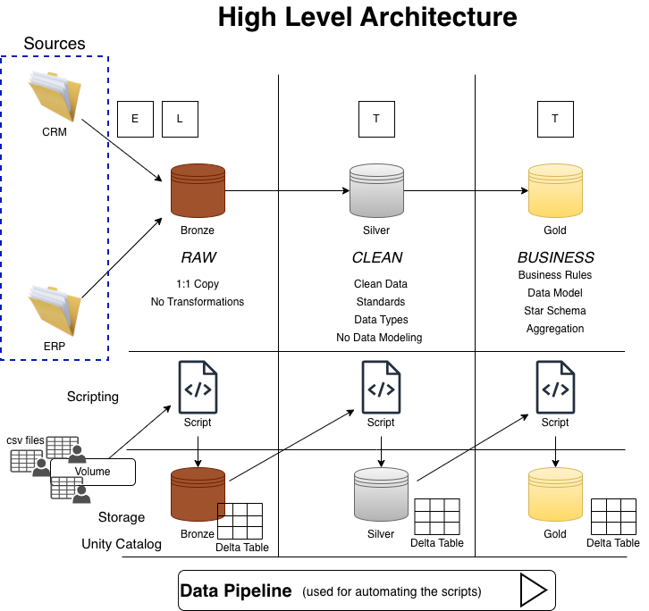

# Data Lakehouse — Version 1

A modern **data lakehouse built with Databricks, PySpark, Delta Lake, and Unity Catalog** to transform raw ERP and CRM sales data into clean, business-ready datasets for analytics and reporting.

> **Project Status:** Version 1
> This repository is part of an evolving Data Lakehouse project. Later versions extend the architecture with streaming, API ingestion, CI/CD, automated testing, dbt, data quality frameworks, and machine learning.

## Project Evolution

* **Version 1:** Batch-based lakehouse using CSV sources, Medallion Architecture, PySpark, Spark SQL, Delta Lake, Unity Catalog, and Databricks Jobs.
* **Version 2:** Added PostgreSQL and REST API ingestion, Apache Kafka streaming, Databricks Asset Bundles, GitHub Actions CI/CD, and pytest unit testing.
  **[View V2](https://github.com/ap001AP/sql-data-lakehouse-project/tree/lakehouse_v2)**
* **Version 3:** Added dbt transformation models, automated data quality testing, Great Expectations Bronze validation, data lineage, and an ML layer using MLflow for sales forecasting and customer segmentation.
  **[View V3](https://github.com/ap001AP/sql-data-lakehouse-project/tree/lakehouse_v3)**

---

## Architecture

The project follows the **Medallion Architecture**, separating data processing into three layers:



### Bronze — Raw Data

The Bronze layer stores source data in its original structure.

* Ingests 6 CSV files from ERP and CRM systems
* Stores data as **Delta tables**
* Preserves the raw source structure
* Uses `erp_` and `crm_` prefixes to identify source systems
* Uses overwrite-based batch ingestion for the latest dataset

**Purpose:** Provide a reliable landing layer while preserving the original source data for downstream processing.

### Silver — Cleaned & Standardized Data

The Silver layer transforms raw Bronze data into clean and standardized datasets.

Key transformations include:

* Duplicate detection and removal
* Null and invalid value handling
* String cleanup and standardization
* Date validation and formatting
* Numeric data validation
* Business identifier standardization
* Preparation of datasets for downstream joins

**Purpose:** Create consistent and trustworthy data before business modeling.

### Gold — Business Data Model

The Gold layer moves away from the source-system structure and organizes data around business concepts.

The final model follows a **star schema** containing:

* `fact_sales`
* `dim_customers`
* `dim_products`

Gold tables are created by joining relevant Silver datasets and validating the resulting records.

**Purpose:** Provide business-ready datasets optimized for analytical queries and reporting.

---

## Data Pipeline

The end-to-end pipeline is orchestrated using **Databricks Jobs**.

```text
                         Bronze Ingestion
                                │
                                ▼
                       Silver Orchestration
                                │
                  ┌─────────────┼─────────────┐
                  │             │             │
                  ▼             ▼             ▼
             Silver 1      Silver 2       Silver ...
                  │             │             │
                  └─────────────┼─────────────┘
                                ▼
                        Gold Orchestration
                                │
                  ┌─────────────┼─────────────┐
                  │             │             │
                  ▼             ▼             ▼
            dim_customers  dim_products   fact_sales
                  │             │             │
                  └─────────────┼─────────────┘
                                ▼
                       Analytics & Reporting
```

### Orchestration

Two orchestration notebooks coordinate the downstream transformations:

* `silver_orchestration.py`
* `gold_orchestration.py`

These notebooks use `dbutils.notebook.run` to execute individual transformation notebooks.

The Databricks Job consists of three main stages:

1. **Bronze:** Ingest source CSV files into Delta tables
2. **Silver:** Clean and standardize the source data
3. **Gold:** Build the business-oriented star schema

The pipeline can be scheduled and monitored through Databricks Jobs.

---

## Data Modeling

The original source data is organized around ERP and CRM systems. Rather than exposing the source structure directly to analysts, the Gold layer reorganizes the data around business entities.

### Star Schema

```text
                 ┌───────────────────┐
                 │   dim_customers   │
                 │───────────────────│
                 │ customer_id       │
                 │ customer attributes
                 └─────────┬─────────┘
                           │
                           │
                           ▼
                    ┌──────────────┐
                    │  fact_sales  │
                    │──────────────│
                    │ sale_id      │
                    │ customer_id  │
                    │ product_id   │
                    │ quantity     │
                    │ sales_amount │
                    └──────┬───────┘
                           │
                           │
                           ▼
                 ┌───────────────────┐
                 │   dim_products    │
                 │───────────────────│
                 │ product_id        │
                 │ product attributes
                 └───────────────────┘
```

The model separates:

* **Facts:** Measurable business events such as sales
* **Dimensions:** Descriptive entities such as customers and products

This allows analysts to query sales data without needing to understand the underlying ERP and CRM source structures.

---

## Data Quality

Data quality checks are primarily performed during the Silver transformation stage.

| Check                  | Purpose                                                   |
| ---------------------- | --------------------------------------------------------- |
| Duplicate detection    | Prevent duplicate records from entering downstream tables |
| Null validation        | Identify missing required values                          |
| String standardization | Remove inconsistent formatting and whitespace             |
| Date validation        | Ensure dates are correctly typed and formatted            |
| Numeric validation     | Identify invalid numeric values                           |
| ID standardization     | Ensure business keys can be reliably joined               |

The goal is to prevent poor-quality source data from propagating into the Gold layer.

---

## Project Requirements

The lakehouse was designed to:

* Consolidate ERP and CRM sales data
* Process data using a scalable Spark-based architecture
* Separate raw, cleaned, and business-ready datasets
* Apply data quality transformations before analytical modeling
* Build a unified star schema
* Automate the complete Bronze → Silver → Gold workflow
* Support SQL-based analytics and reporting

The project focuses on the **latest available dataset** rather than historical tracking or slowly changing dimensions.

---

## Technology Stack

| Technology          | Purpose                                         |
| ------------------- | ----------------------------------------------- |
| **Databricks**      | Lakehouse platform and Spark environment        |
| **PySpark**         | Distributed data processing and transformations |
| **Spark SQL**       | SQL-based data transformations and analysis     |
| **Delta Lake**      | Transactional storage layer                     |
| **Unity Catalog**   | Data organization and governance                |
| **Databricks Jobs** | Pipeline orchestration and scheduling           |
| **GitHub**          | Source control and project versioning           |
| **draw.io**         | Data architecture and schema design             |

---

## Repository Structure

```text
sql-data-lakehouse-project/
│
├── datasets/
│   └── source CSV files
│
├── docs/
│   └── data_lakehouse_arch.png
│
├── notebooks/
│   ├── bronze/
│   ├── silver/
│   ├── gold/
│   └── orchestration/
│
├── README.md
└── LICENSE
```

---

## Key Engineering Concepts

This project demonstrates experience with:

* Modern data lakehouse architecture
* Medallion Architecture
* Batch ETL pipelines
* Distributed data processing with PySpark
* Delta Lake
* Data cleansing and validation
* Dimensional data modeling
* Star schemas
* Pipeline orchestration
* SQL analytics
* Cloud data platforms
* Version-controlled data engineering workflows

---

## Future Development

Version 1 established the core batch-based lakehouse architecture. The project was subsequently extended in Versions 2 and 3 with:

* PostgreSQL ingestion
* REST API ingestion
* Apache Kafka streaming
* Databricks Asset Bundles
* GitHub Actions CI/CD
* pytest unit testing
* dbt transformation models
* Automated data quality testing
* Great Expectations validation
* Data lineage documentation
* MLflow experiment tracking
* Sales forecasting
* Customer segmentation
* Model Registry
* Model Serving REST endpoint

**[View Version 2](https://github.com/ap001AP/sql-data-lakehouse-project/tree/lakehouse_v2)**
**[View Version 3](https://github.com/ap001AP/sql-data-lakehouse-project/tree/lakehouse_v3)**

---

## License

This project is licensed under the [MIT License](LICENSE).
